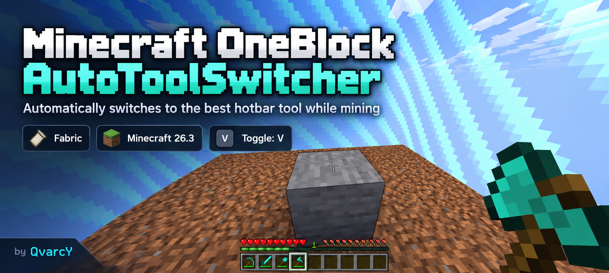
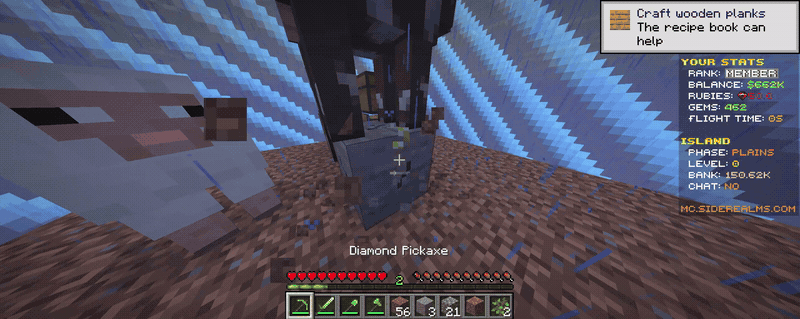

<p align="center">
  
</p>

<p align="center">
  <a href="https://github.com/QvarcY/minecraft-oneblock-autotoolswitcher/actions/workflows/build.yml"></a>
  <a href="https://github.com/QvarcY/minecraft-oneblock-autotoolswitcher/blob/main/LICENSE"></a>
  <a href="https://buymeacoffee.com/craftin"></a>
  <a href="https://github.com/sponsors/QvarcY"></a>
</p>

<p align="center">
  <a href="#latviski">Latviski</a> · <a href="#english">English</a>
</p>

> Lightweight client-side Fabric mod for OneBlock players who are tired of doing pickaxe → axe → shovel → pickaxe gymnastics every few seconds

**Available builds:** Minecraft 26.2 and Minecraft 26.3 · Fabric Loader 0.19.5+ · Java 25

Minecraft 26.2 has been validated on a real multiplayer OneBlock server · Minecraft 26.3 has a verified compatible build and will be multiplayer-tested when suitable servers update

## Download

| Minecraft | Build | Status | Download |
| --- | --- | --- | --- |
| **26.2** | `1.0.0+mc26.2` | Real multiplayer OneBlock tested | **[Download JAR](https://github.com/QvarcY/minecraft-oneblock-autotoolswitcher/releases/download/v1.0.0/minecraft-oneblock-autotoolswitcher-1.0.0%2Bmc26.2.jar)** |
| **26.3** | `1.0.0+mc26.3` | CI verified | **[Download JAR](https://github.com/QvarcY/minecraft-oneblock-autotoolswitcher/releases/download/v1.0.0/minecraft-oneblock-autotoolswitcher-1.0.0%2Bmc26.3.jar)** |

> Download **only the JAR that matches your Minecraft version**. Do not put both AutoToolSwitcher JARs in the same `mods` folder.

[View the full v1.0.0 release](https://github.com/QvarcY/minecraft-oneblock-autotoolswitcher/releases/tag/v1.0.0)

## Demo

**LV:** Reāls Minecraft 26.2 multiplayer OneBlock tests — AutoToolSwitcher automātiski pārslēdzas starp piemērotāko pickaxe axe un shovel kamēr uzbrukuma poga paliek nospiesta

**EN:** Real Minecraft 26.2 multiplayer OneBlock test — AutoToolSwitcher automatically switches between the best available pickaxe axe and shovel while the attack button stays held

<p align="center">
  
</p>

---

## Latviski

### Kas tas ir

Minecraft OneBlock AutoToolSwitcher ir neliels client-side Fabric mods kas automātiski izvēlas piemērotāko rīku no hotbar brīdī kad roc bloku

Tas radīts OneBlock spēles režīmam kur viens un tas pats bloks nepārtraukti pārvēršas citā resursā tomēr tas var būt noderīgs arī parastā Survival spēlē

### Ko tas dara

- pārbauda bloku uz kuru pašlaik sit
- pārskata hotbar slotus 1–9
- izvēlas piemērotāko pieejamo rīku
- dod priekšroku rīkam kas nodrošina pareizu dropu
- neizmanto gandrīz salūzušus rīkus ja tiem palikušas 5 vai mazāk izturības vienības
- pārslēdzas tikai kamēr tiešām roc bloku
- darbojas tikai klienta pusē
- ar `V` var ieslēgt vai izslēgt automātisko pārslēgšanu

### Ātrā uzstādīšana

#### 1. Izvēlies savu Minecraft versiju

- **Minecraft 26.2** → [lejupielādē 26.2 JAR](https://github.com/QvarcY/minecraft-oneblock-autotoolswitcher/releases/download/v1.0.0/minecraft-oneblock-autotoolswitcher-1.0.0%2Bmc26.2.jar)
- **Minecraft 26.3** → [lejupielādē 26.3 JAR](https://github.com/QvarcY/minecraft-oneblock-autotoolswitcher/releases/download/v1.0.0/minecraft-oneblock-autotoolswitcher-1.0.0%2Bmc26.3.jar)

Izmanto tikai savai Minecraft versijai paredzēto AutoToolSwitcher JAR. **Neliec abus AutoToolSwitcher JAR vienā `mods` mapē.**

#### 2. Uzstādi Fabric

Tai pašai Minecraft versijai uzstādi:

- Fabric Loader **0.19.5 vai jaunāku**
- Fabric API, kas paredzēts tieši tavai Minecraft versijai

#### 3. Ievieto failus `mods` mapē un palaid spēli

`mods` mapē jābūt:

- Fabric API JAR
- vienam AutoToolSwitcher JAR tavai Minecraft versijai

Windows noklusētais ceļš parasti ir

```text
%AppData%\.minecraft\mods
```

Ja izmanto launcher ar atsevišķām instancēm, izmanto konkrētās instances `mods` mapi.

Palaid Minecraft ar Fabric profilu, ieliec piemērotos rīkus hotbar un turi nospiestu kreiso peles pogu uz bloka. AutoToolSwitcher izvēlēsies piemērotāko rīku automātiski.

Ja spēle startā ziņo par nesaderīgu modu, vispirms pārbaudi, vai AutoToolSwitcher JAR, Fabric API un Minecraft versija savā starpā sakrīt.

### Atbalstītās Minecraft versijas

- ✅ Minecraft 26.2 — pieejams builds un pārbaudīts reālā multiplayer OneBlock serverī
- ✅ Minecraft 26.3 — pieejams saderīgs builds un pārbaudīts ar CI build testu

### Vadība

`V` — ieslēgt vai izslēgt AutoToolSwitcher

Taustiņu var mainīt Minecraft sadaļā `Options → Controls → Key Binds`

### Multiplayer

Šis ir client-side mods un serverī nekas nav jāinstalē

Tomēr multiplayer serveriem var būt savi noteikumi par automātiskiem QoL rīkiem tāpēc pirms lietošanas pārbaudi konkrētā servera noteikumus

### Būvēšana no pirmkoda

Nepieciešams Java 25

```powershell
.\gradlew.bat build
```

Gatavais JAR būs mapē

```text
build\libs
```

### Atbalsti projektu

- ☕ **[Buy Me a Coffee](https://buymeacoffee.com/craftin)** — atbalsti projekta turpmāku izstrādi
- ❤️ **[GitHub Sponsors](https://github.com/sponsors/QvarcY)** — atbalsti QvarcY open-source projektus
- 🐙 **[QvarcY GitHub](https://github.com/QvarcY)** — citi projekti un eksperimenti

---

## English

### What is it

Minecraft OneBlock AutoToolSwitcher is a small client-side Fabric mod that automatically picks the most suitable tool from your hotbar while you are mining a block

It was built for OneBlock where the same block keeps turning into completely different resources but it can also be useful in regular Survival

### What it does

- checks the block you are currently mining
- scans hotbar slots 1–9
- selects the best available tool
- prefers tools that preserve the correct block drops
- avoids nearly broken tools with 5 or fewer durability points left
- switches only while you are actually mining
- runs entirely on the client
- press `V` to toggle automatic switching

### Quick installation

#### 1. Choose your Minecraft version

- **Minecraft 26.2** → [download the 26.2 JAR](https://github.com/QvarcY/minecraft-oneblock-autotoolswitcher/releases/download/v1.0.0/minecraft-oneblock-autotoolswitcher-1.0.0%2Bmc26.2.jar)
- **Minecraft 26.3** → [download the 26.3 JAR](https://github.com/QvarcY/minecraft-oneblock-autotoolswitcher/releases/download/v1.0.0/minecraft-oneblock-autotoolswitcher-1.0.0%2Bmc26.3.jar)

Use only the AutoToolSwitcher JAR built for your Minecraft version. **Do not put both AutoToolSwitcher JARs in the same `mods` folder.**

#### 2. Install Fabric

For the same Minecraft version install:

- Fabric Loader **0.19.5 or newer**
- Fabric API built specifically for your Minecraft version

#### 3. Put the files in `mods` and launch the game

Your `mods` folder should contain:

- the Fabric API JAR
- one AutoToolSwitcher JAR matching your Minecraft version

The default Windows location is usually

```text
%AppData%\.minecraft\mods
```

If you use a launcher with separate instances, use that instance's own `mods` folder.

Launch Minecraft with the Fabric profile, keep suitable tools in your hotbar and hold the left mouse button on a block. AutoToolSwitcher will select the most suitable tool automatically.

If Minecraft reports an incompatible mod during startup, first check that the AutoToolSwitcher JAR, Fabric API and Minecraft versions all match.

### Supported Minecraft versions

- ✅ Minecraft 26.2 — available build validated on a real multiplayer OneBlock server
- ✅ Minecraft 26.3 — available compatible build verified by CI

### Controls

`V` — toggle AutoToolSwitcher

You can change the key in `Options → Controls → Key Binds`

### Multiplayer

This is a client-side mod and nothing needs to be installed on the server

Multiplayer servers can have their own rules for automation and QoL mods so check the rules of the server you play on

### Building from source

Java 25 is required

```powershell
.\gradlew.bat build
```

The built JAR will be available in

```text
build\libs
```

### Support the project

- ☕ **[Buy Me a Coffee](https://buymeacoffee.com/craftin)** — support continued development
- ❤️ **[GitHub Sponsors](https://github.com/sponsors/QvarcY)** — support QvarcY's open-source work
- 🐙 **[QvarcY on GitHub](https://github.com/QvarcY)** — more projects and experiments

---

## License

MIT License

Created by [QvarcY](https://github.com/QvarcY)

Minecraft OneBlock AutoToolSwitcher is an independent community project and is not affiliated with Mojang or Microsoft
